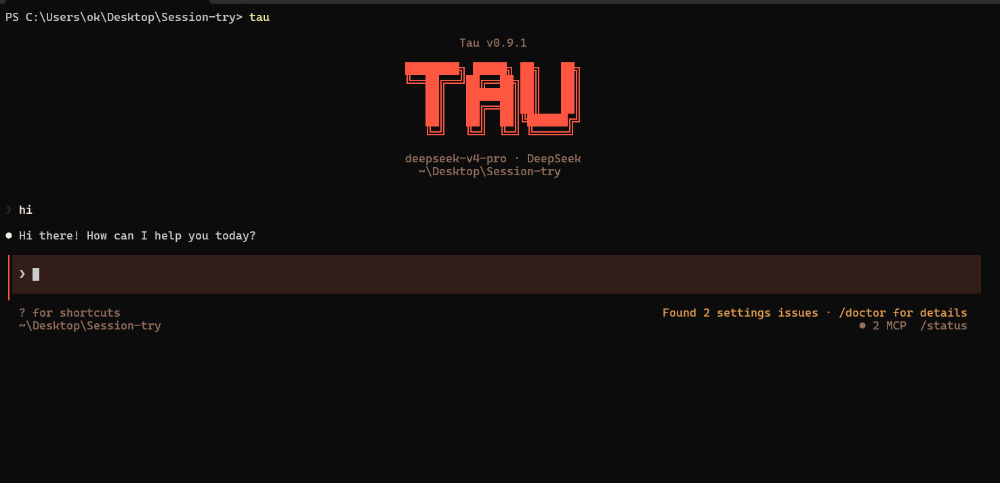

<p align="center">
  
</p>

# Tau — The Best Free Coding Agent

[](https://www.npmjs.com/package/@abdoknbgit/tau)
[](https://www.npmjs.com/package/@abdoknbgit/tau)
[](https://www.npmjs.com/package/@abdoknbgit/tau)

---

## What is Tau?

Tau has become the best free coding agent — a single tool that fuses the **Claude Code** and **OpenCode** ecosystems into one mixed agentic environment. You get the strongest parts of both agents, plus new features and optimizations layered on top.

Native adapters for **23 providers**. Not a proxy, not a wrapper around someone else's wrapper. When you use Gemini, Tau speaks Gemini's API directly. Same for OpenAI, GLM, DeepSeek, Mistral, OpenRouter, AgentRouter, Vercel AI Gateway, Requesty, MiniMax, OpenCode Zen, and the rest. Full list with per-provider notes in [PROVIDERS.md](PROVIDERS.md).

Install once. Type `/login`. Pick a provider. Work.

That's it: plug and play with one command and one login flow. No shell configuration. No export statements. No environment variable archaeology. A first-run wizard handles credentials and saves them.

---

## Why Tau exists

The price of AI keeps climbing. The leading agents either lock you into a single subscription, gate the good features behind enterprise tiers, or quietly burn through your wallet on per-token billing the moment you do real work. Hit a rate limit on one provider and your day stops.

Tau gives you a way out. **You can work with any provider without that provider's official tool installed on your machine.** Not Codex CLI, not Gemini CLI, not Cursor, not Antigravity, not Cline, not KiloCode, not Kiro, not Copilot — none of them downloaded, none of them configured, none of them present. Tau brings the runtime. You bring whatever API key or auth flow you already have.

Anthropic giving you the cold shoulder? Switch to Kimi K2.6 mid-session. Burning credits on one route? Move to OpenCode Zen's free deepseek-v4-flash. Same agent loop, same file editing, same MCP servers, same hooks — just a different brain.

Same experience. Different brain. Zero dependencies on the original tools.

---

## Install

```bash
npm install -g @abdoknbgit/tau
```

**Requirements:** Node.js >= 20.0.0, Git, Bash, `gh` for GitHub automation.

---

## Launch

```bash
tau
```

Launch with skip permission mode:

```bash
tau --dangerously-skip-permissions
```

---

## Update

```bash
tau update
```

<p align="center">
  
</p>
<video src="https://github.com/user-attachments/assets/07862fa1-5f0f-4027-97e7-9e147d74f999" controls width="100%"></video>

## The Commands You Need to Know

### Auth

**`/login` - Start here**
Pick a provider, enter your credentials, and Tau saves the setup. No env variables, no config hunt.

### Models

**`/models` - Pick your model**
Live model browser. Fetches the real catalog from your provider API, lets you search, filter, and set the active model.

```
/models                     open the full picker
/models <query>             search active provider
/models openrouter:kimi     search a specific provider
/model kimi-k2-5            set a model directly
```

### Web Search

**`WebSearch` - Firecrawl-hosted web search**
The `web_search` tool is hosted with Firecrawl and works across providers. Firecrawl offers 1k searches/month on free trials; just enter your API key.

Setup is one step: `/login` -> **Firecrawl Search** -> paste your Firecrawl API key. After that, agents can search current web information automatically when a question needs live or recent data.

### Voice

**`/hey` - Start a voice conversation**
Turns on voice conversation mode. Hold Space to talk, release to send, and Tau shows what it heard before submitting.

**`/bye` - End the voice conversation**
Turns voice conversation mode off and stops any spoken reply that is still playing.

### Session

**`/tree` - Navigate the session graph**
Move through your conversation history like nodes, so branches and forks stay understandable.

**`/clone` - Clone the session**
Create a copy of the current session when you want a backup or a clean duplicate to continue from.

**`/branch` - Open a fork**
Start a fork from the current point in the session without losing the original path.

**`/resume` - Continue later**
Resume the last useful session or pick an older one when you want to continue where you left off.

### Orchestration

**`/team-mode` - Orchestrator with worker agents**
Multi-provider agent orchestration. One coordinator delegates work to a team of workers and they communicate both **vertically** (coordinator ↔ workers, for task delegation and result handoff) and **horizontally** (worker ↔ worker, for direct collaboration without round-tripping through the coordinator). Each worker can run on a different provider/model, and the orchestrator automatically falls back when a worker fails so the team keeps moving.

### Monitoring and Reporting

**`/usage` - Watch provider usage**
Shows real streaming provider usage as it happens, so you can see provider consumption while working.

**`/statistics` - Review the current session**
Shows statistics for the active session, including session activity and tool-call details.

**`/report` - Generate a final report**
Creates a clean content report for the session in Markdown, PDF, or HTML. This is for readable session quality, not usage statistics.

### Features

**`/fallback` - Recover automatically**
Automatic recovery when a model fails mid-session. Configure a fallback and keep working through provider outages.

**`/dangerously-skip-permissions` - Skip permission prompts in a trusted sandbox**
Session-only Bypass Permissions mode. Tau shows a warning before enabling it, permission prompts include the same session option, and `/dangerously-skip-permissions off` returns to Default mode.

Launch Tau directly in this mode:

```bash
tau --dangerously-skip-permissions
```

**`/whatsapp` - Remote control Tau from WhatsApp**
Link WhatsApp and control Tau from your phone.

**`/github` - GitHub automation (gh required)**
GitHub workflows inside Tau, powered by the GitHub CLI.

- `issue` - Inspect issues for the current repo, or pass an issue URL to inspect that issue.
- `pr` - Inspect pull requests (repo-local or via PR URL) and generate gh-backed actions.
- `wrap` - Stage → commit → (optional changelog) → push, with one permission gate before network writes.
- `changelog` - Generate/update changelog notes from commit history in a consistent style.
- `triage` - Classify issues (labels/status) with explicit confirmation before visible changes.
- `release` - Release flow: inspect dirty working tree, check CI/CD workflow status, then tag/publish and list runs.

**`/safetest` - Run a file inside a disposable cloud sandbox**
Upload one file to a fresh E2B VM, run it there, get a clean report back. The local machine never executes anything. Each run gets its own throwaway sandbox that's destroyed at the end.

Setup is one step: `/login` → **E2B Security** → pick "Auth login" (opens the E2B dashboard in your browser) or "API key" (just paste). After that, `/safetest` is ready — no env variables, no extra config.

**`/pin` - Pin a constraint to every prompt**
Save a sentence (or two) and Tau quietly appends it to the end of every message you send — a persistent reminder the model carries through the whole session without you retyping it. Use it for style rules ("reply in French"), guardrails ("never edit files outside `src/`"), or task focus ("stay on the auth refactor"). Cache-safe by design: only the dynamic tail of the user message changes, so your provider's prompt cache stays warm and the cost is a few extra tokens per turn.

---

## Supported Providers

23 providers with native adapters. See the full list and per-provider notes in **[PROVIDERS.md](PROVIDERS.md)**.

---

## Features

**Multi-provider, natively**
23 providers with native adapters. Not a routing layer, not a translation proxy — each provider speaks its own API through its own adapter. Full streaming, rate-limit handling, and automatic tool-schema sanitization per provider.

**The full agent loop**
File editing, bash execution, glob, grep, web search, web fetch, MCP servers, hooks (PreToolUse, PostToolUse, UserPromptSubmit, Stop, Notification), skills (/commit, /review-pr, /simplify), and task management — all present, all working across every provider.

**LSP native integration**
Built-in Language Server Protocol support. The agent gets real diagnostics, definitions, references, and hover information from project LSPs (TypeScript, Python, Bash, YAML, and more) without spawning external editor tooling. Type errors, unused symbols, and cross-file references are first-class signal in the agent loop.

**Snapshot with time traveling**
Per-turn working-tree snapshots stored in a shadow git repo separate from your project's `.git`. The agent can `save`, `list`, `diff`, and `restore` — instant undo for any change the agent made, large files (>2 MB) auto-excluded so the store stays small, weekly garbage collection. Travel back to any prior state without touching your branches.

**Multi-provider orchestration**
`/team-mode` runs an orchestrator that delegates to a team of worker agents — each one optionally on a different provider — with vertical (coordinator↔worker) and horizontal (worker↔worker) communication and automatic fallback when a worker fails.

**`web_search` tool**
Firecrawl provides 1k searches/month free for deep searching. Just enter your API key through `/login` -> **Firecrawl Search**.

**Voice conversation**
Use `/hey` to start a voice conversation and `/bye` to end it. Tau can listen, transcribe what you said, send it as your prompt, and optionally speak replies back.

**WhatsApp remote control**
Use `/whatsapp` to link WhatsApp and remotely control Tau from your phone.

**GitHub automation and repo management**
The `/github` command brings common GitHub work into Tau through `gh`: inspect issues and pull requests, review repo state, triage labels/status, generate changelog notes, run wrap-up flows for stage/commit/push, and inspect workflow or release status before publishing changes.

**Scalable context across providers**
Tau adapts context windows when switching between models and providers, so larger-context models can carry more history while smaller-context models stay usable.

**Fallback recovery**
A configurable fallback system can move work to another model/provider when the current one fails or overloads.

**Session management and flexibility**
Tree navigation, cloning, branching, and resume commands make long sessions easier to control without losing context.

**High-visibility monitoring and reporting**
Tau separates live usage, session statistics, and final reports, so you can monitor consumption while still producing readable end-of-session summaries.

---

## License

MIT
