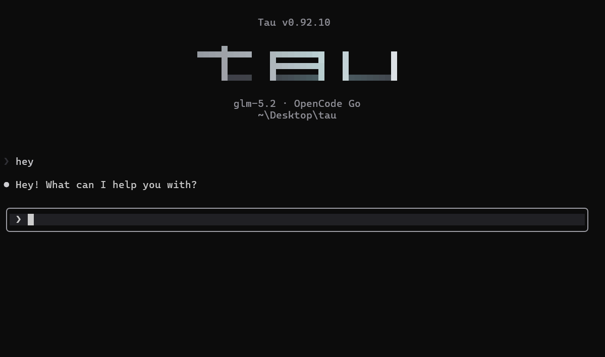

<p align="center">
  
</p>

# Zen The Best Free Coding Agent

[](https://www.npmjs.com/package/@abdoknbgit/zen)
[](https://www.npmjs.com/package/@abdoknbgit/zen)
[](https://www.npmjs.com/package/@abdoknbgit/zen)

---

## What is Zen?

Zen has become the best free coding agent — a single tool that fuses the **Claude Code** and **OpenCode** ecosystems into one mixed agentic environment. You get the strongest parts of both agents, plus new features and optimizations layered on top.

Native adapters for **22 providers**. Not a proxy, not a wrapper around someone else's wrapper. When you use OpenAI, Zen speaks OpenAI's API directly. Same for GLM, DeepSeek, Mistral, OpenRouter, AgentRouter, Vercel AI Gateway, Requesty, Command Code, MiniMax, OpenCode Zen, and the rest. Full list with per-provider notes in [PROVIDERS.md](PROVIDERS.md).

Install once. Type `/login`. Pick a provider. Work.

That's it: plug and play with one command and one login flow. No shell configuration. No export statements. No environment variable archaeology. A first-run wizard handles credentials and saves them.

---

## Why Zen exists

The price of AI keeps climbing. The leading agents either lock you into a single subscription, gate the good features behind enterprise tiers, or quietly burn through your wallet on per-token billing the moment you do real work. Hit a rate limit on one provider and your day stops.

Zen gives you a way out. **You can work with any provider without that provider's official tool installed on your machine.** Not Codex CLI, not Antigravity, not Cline, not KiloCode, not Kiro, not Copilot — none of them downloaded, none of them configured, none of them present. Zen brings the runtime. You bring whatever API key or auth flow you already have.

Anthropic giving you the cold shoulder? Switch to Kimi K2.6 mid-session. Burning credits on one route? Move to OpenCode Zen's free deepseek-v4-flash. Same agent loop, same file editing, same MCP servers, same hooks — just a different brain.

Same experience. Different brain. Zero dependencies on the original tools.

---

## Install

```bash
npm install -g @abdoknbgit/zen
```

**Requirements:** Node.js >= 20.0.0, Git, Bash, `gh` for GitHub automation, and Go 1.25.8+ to build the optional native Zen helpers from source.

If Go is missing, Zen still installs and runs. The native Markdown/code rendering and native read-only helper tools are skipped until Go is available or a package ships the matching prebuilt helper.
_`web_search` tool need _
Firecrawl provides 1k searches/month free for deep searching and its better than normal fetch tool. Just enter your API key through `/login` -> **Firecrawl Search**.

---

## Launch

```bash
zen
```

Launch with skip permission mode:

```bash
zen --dangerously-skip-permissions
```

---

## Update

```bash
zen update
```

<p align="center">
  
</p>
<video src="https://github.com/user-attachments/assets/07862fa1-5f0f-4027-97e7-9e147d74f999" controls width="100%"></video>

## Commands

See the full command list and usage notes in **[COMMANDS.md](COMMANDS.md)**.

---

## Supported Providers

22 providers with native adapters. See the full list and per-provider notes in **[PROVIDERS.md](PROVIDERS.md)**.

---

## Features

**Multi-provider, natively**
22 providers with native adapters. Not a routing layer, not a translation proxy — each provider speaks its own API through its own adapter. Full streaming, rate-limit handling, and automatic tool-schema sanitization per provider.

**The full agent loop**
File editing, bash execution, glob, grep, web search, web fetch, MCP servers, hooks (PreToolUse, PostToolUse, UserPromptSubmit, Stop, Notification), skills (/commit, /review-pr, /simplify), and task management — all present, all working across every provider.

**LSP native integration**
Built-in Language Server Protocol support. The agent gets real diagnostics, definitions, references, and hover information from project LSPs (TypeScript, Python, Bash, YAML, and more) without spawning external editor tooling. Type errors, unused symbols, and cross-file references are first-class signal in the agent loop.

**Snapshot with time traveling**
Per-turn working-tree snapshots stored in a shadow git repo separate from your project's `.git`. The agent can `save`, `list`, `diff`, and `restore` — instant undo for any change the agent made, large files (>2 MB) auto-excluded so the store stays small, weekly garbage collection. Travel back to any prior state without touching your branches.

**Multi-provider orchestration(currenty in maintainace and not stable so its will back soon!!!!!!!!!! )**
`/team-mode` runs an orchestrator that delegates to a team of worker agents — each one optionally on a different provider — with vertical (coordinator↔worker) and horizontal (worker↔worker) communication and automatic fallback when a worker fails.

**`web_search` tool**
Firecrawl provides 1k searches/month free for deep searching. Just enter your API key through `/login` -> **Firecrawl Search**.

**Voice conversation**
Use `/hey` to start a voice conversation and `/bye` to end it. Zen can listen, transcribe what you said, send it as your prompt, and optionally speak replies back.

**WhatsApp remote control**
Use `/whatsapp` to link WhatsApp and remotely control Zen from your phone.

**GitHub automation and repo management**
The `/github` command brings common GitHub work into Zen through `gh`: inspect issues and pull requests, review repo state, triage labels/status, generate changelog notes, run wrap-up flows for stage/commit/push, and inspect workflow or release status before publishing changes.

**Scalable context across providers**
Zen adapts context windows when switching between models and providers, so larger-context models can carry more history while smaller-context models stay usable.

**Fallback recovery**
A configurable fallback system can move work to another model/provider when the current one fails or overloads.

**Session management and flexibility**
Tree navigation, cloning, branching, and resume commands make long sessions easier to control without losing context.

**High-visibility monitoring and reporting**
Zen separates live usage, session statistics, and final reports, so you can monitor consumption while still producing readable end-of-session summaries.

**Self-learning & self-improvement**
Zen gets better the more you use it. After a substantial task — or on demand via `/learned` — it proposes one critical, general, reusable lesson (a framework gotcha, a whole class of bug to avoid, a hard-won constraint, or your own preference) for you to Approve / Edit / Skip. Approved lessons are saved to memory and carried from this session into future ones and other projects, so the work keeps compounding instead of starting cold. Review, edit, delete, or toggle everything it learns with `/learned`.

---

## License

MIT
